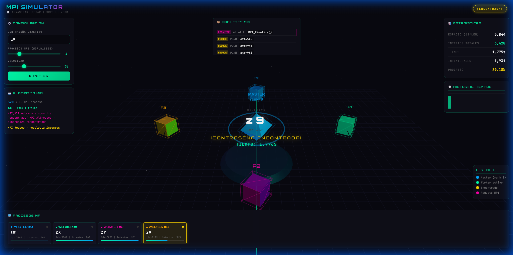

# 🚀 MPI Password Cracker - 3D Simulation

> **Simulador Visual de Computación Paralela Distribuida**

Un entorno interactivo y visualmente impactante diseñado para demostrar cómo un clúster MPI (Message Passing Interface) ataca un problema de fuerza bruta distribuida para descifrar contraseñas.

---

## ⚡ Características Principales

| Icono | Característica | Descripción |
| :---: | :--- | :--- |
| 🌐 | **Visualización 3D** | Renderizado en tiempo real con **Three.js**, mostrando nodos y paquetes de datos viajando por la red. |
| 🖥️ | **Simulación MPI** | Emulación fiel de primitivas MPI como `MPI_Init`, `MPI_Send`, `MPI_Recv`, `MPI_Reduce` y `MPI_Allreduce`. |
| 🎛️ | **Control Total** | Ajusta el número de procesos (Workers), la velocidad de simulación y la contraseña objetivo en tiempo real. |
| 📊 | **Estadísticas en Vivo** | Monitoreo de intentos por segundo, tiempo transcurrido, espacio de búsqueda total y progreso global. |
| 📦 | **Log de Paquetes** | Visualiza el tráfico de red, identificando tipos de mensajes (Send, Recv, Reduce) con códigos de color. |

---

## 🧠 ¿Cómo Funciona?

El simulador visualiza un algoritmo de fuerza bruta distribuido:

1.  **Distribución del Espacio**: Cada proceso ("Worker") recibe un rango específico de combinaciones posibles basado en su `rank` y el `world_size`.
    *   *Fórmula*: `idx = rank + i * world_size`
2.  **Cálculo Distribuido**: Los nodos computan hashes en paralelo, buscando coincidencia con el objetivo.
3.  **Comunicación**:
    *   Si un nodo encuentra la contraseña, notifica al Root (Rank 0).
    *   Se usan operaciones de reducción (`MPI_Allreduce`) para sincronizar el estado de "Encontrado".

---

## 🛠️ Tecnologías

*   **Core**: HTML5, JavaScript (ES6+)
*   **Gráficos**: [Three.js](https://threejs.org/) (WebGL)
*   **Estilos**: CSS3 con diseño *Glassmorphism* y tipografías *Cyberpunk* (Orbitron, JetBrains Mono).

---

  Desarrollado para Prácticas de Ingeniería de Computadores

